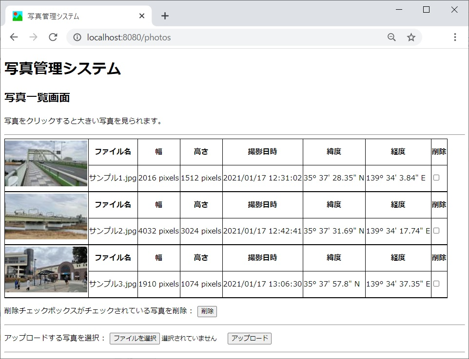
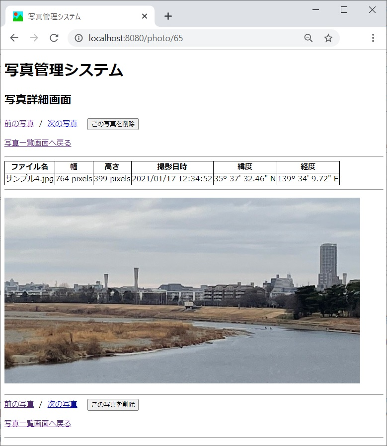
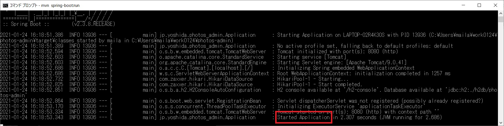
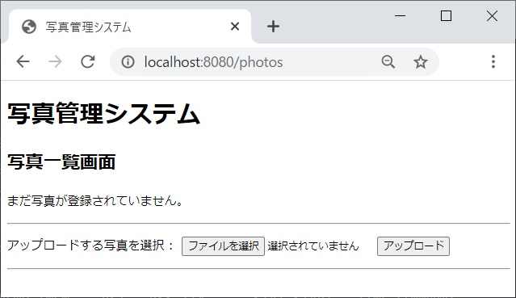
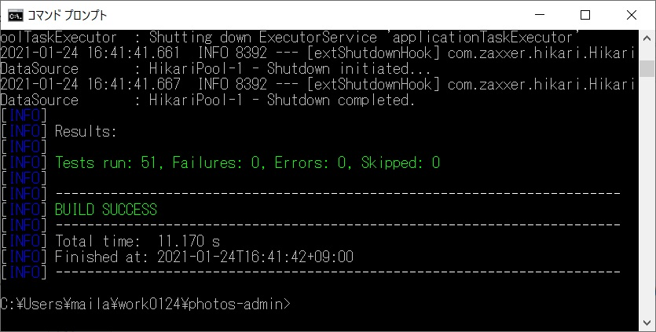
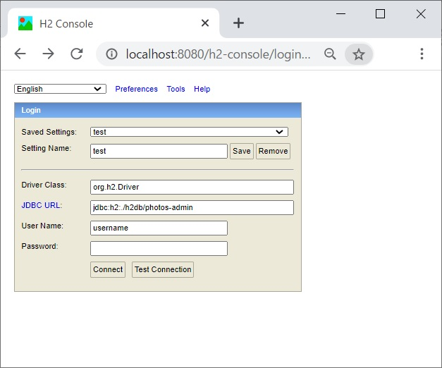

# 写真管理システム

## 説明

写真管理システムはユーザーが写真や画像ファイルをアップロードしたり、アップロードされた写真や画像ファイルを表示したりするWebシステムです。

## 概要

写真管理システムは以下の2つの画面から構成されており、各画面からの操作によって写真や画像ファイルのアップロードや閲覧・削除ができるようになっています。

### １．写真一覧画面

写真管理システムの初期画面です。

当画面では登録済みの写真のサムネイルを一覧で表示します。さらにサムネイルの右側にファイル名を表示します。
なお、写真に撮影日時や緯度・経度などのメタデータが登録されている場合は、サムネイルの右側にメタデータを表示します。

また、写真一覧画面には以下の機能があります。

・一覧に表示されているサムネイルをクリックすると、後述する写真詳細画面に遷移して該当の写真を大写しにして閲覧できます。

・一覧の右端のチェックボックスをチェックして「削除」ボタンを押下すると、該当の写真を削除します。
なお、複数のチェックボックスが選択されている場合は複数の写真をまとめて削除します。
そして写真の削除後は自画面に遷移して、写真が削除された状態を一覧に反映します。

・「ファイル選択」ボタンを押下するとユーザーの端末上の写真や画像ファイルを選択でき、
ファイルを選択した状態で「アップロード」ボタンを押下すると選択したファイルをアップロードして写真管理システムに登録します。
そして写真のアップロード後は自画面に遷移して、アップロードされた写真を一覧に反映します。
なお、アップロード可能な写真の最大ファイルサイズは1MBに設定しています。

以下は写真一覧画面のイメージです。



### ２．写真詳細画面

写真を大写しにして閲覧する画面です。

当画面では登録済みの写真の内、選択した1枚の写真を大写しにして表示します。さらに写真の上にファイル名を表示します。
なお、写真に撮影日時や緯度・経度などのメタデータが登録されている場合は、写真の上にメタデータを表示します。

また、写真詳細画面には以下の機能があります。

・「前の写真」リンクや「次の写真」リンクを押下すると、自画面に遷移して、その写真の前後に登録されている写真を表示します。

・「この写真を削除」ボタンを押下すると、該当の写真を削除して写真一覧画面に遷移します。

・「写真一覧画面に戻る」リンクをクリックすると写真一覧画面に遷移します。

以下は写真詳細画面のイメージです。



## 特筆すべきポイント

写真管理システムはプロパティファイルを用いた多言語化に対応しており、デフォルトでは日本語を表示し、
ブラウザの言語設定が英語に設定されている場合には画面表示もエラーメッセージも全てが英語で表示されるようになっています。
なお、現状では日本語と英語の2カ国語を実装していますが、他の言語のプロパティファイルを追加することによって、
容易に他の言語も表示できる仕組みになっています。

また、写真管理システムはブラウザのJavascriptがOFFにされていても、写真の閲覧・登録・削除の全ての機能が問題なく使用できるようになっています。
なお、JavascriptがOFFの場合にはポップアップメッセージの代わりに画面に直接メッセージを表示するようになっています。

また、入力値のエラーチェックはクライアントチェックもサーバーチェックも完備していて不正値が入らないようになっており、
さらに、写真データに不備がある場合にも適切に検知してエラーメッセージを表示する堅牢な設計となっています。

## 使用技術

写真管理システムはJavaとSpring Bootを用いて構築しており、Mavenでライブラリ依存関係の設定とビルド管理をしています。

また、画面出力はThymeleafを用いたスマートな実装となっています。

さらに、データベースはH2 Databaseの組み込みデータベース機能を使用しており、
プロジェクトフォルダ内にDBファイルを生成して写真データを登録する仕組みになっています。
そのため、別途DBサーバーを立ち上げることなく、スタンドアロンで起動できるようになっているので、お手元で実行して頂きやすくなっています。

そして、3層アーキテクチャの原則に従ったクリーンな設計・実装をしているため、仕様変更や機能拡張にも柔軟に対応できる設計となっています。
さらに、JUnitを用いたユニットテストを完備していることも相まって、バグが混入しがたい非常に高品質・高信頼なシステムに仕上がっています。

## 起動方法

前提条件として、お使いのパソコンにJava11とMavenがインストールされているものとします。

１．写真管理システムのリポジトリをGitHubからクローンまたはZipとしてダウンロードして解凍する。

以下はクローンする場合のコマンドです（クローンする場合はお使いのパソコンにGitがインストールされている必要があります）。
```text:クローンする場合のコマンド
git clone https://github.com/Tomoyuki-Yoshida-1983/photos-admin.git
```

２．１．でクローンまたはダウンロードして解凍したプロジェクトフォルダの直下に移動する。

```text:リポジトリのフォルダ直下に移動するコマンド
cd photos-admin
```

３．以下のコマンドを実行する。 

※注 Git For Windowsのターミナルでは`Ctrl + C`を受け付けなくなる既知の不具合がありますので、
Windowsの標準のコマンドプロンプトを使用することをお勧めします。

なお、お使いのパソコンの性能とネットワーク環境によってはコマンド実行後、ビルドと起動が完了するまでに数分掛かる場合があります。

```text:写真管理システムを起動するコマンド
mvn spring-boot:run
```

コマンド実行後、以下のように「Started Application」と表示されれば起動完了です。



４．ブラウザから以下のURLにアクセスして、写真管理システムの写真一覧画面が表示されれば起動成功です。

```text:写真管理システムの写真一覧画面のURL
http://localhost:8080/photos
```



## 停止方法

起動方法の３．で起動した写真管理システムを停止する場合には、起動したコマンドプロンプトで`Ctrl + C`を入力し、
「バッチ ジョブを終了しますか (Y/N)?」というメッセージが表示されたら`Y`を入力して`Enter`を押下すると停止できます。

## 補記

クローンまたはダウンロードして解凍したリポジトリのフォルダ直下で以下のコマンドを実行することで、
ユニットテストを実行してテスト結果を確認することができます。

```text:ユニットテストの実行コマンド
mvn test
```




また、写真管理システムの起動中にブラウザから以下のURLにアクセスすることで、データベースの中身を直接閲覧・更新するコンソール機能を使用できますので、
データベースの内容を直接確認したい場合にはデバッグ機能としてご利用頂けます。

```text:URL
http://localhost:8080/h2-console
```

```text:コンソールログイン画面の設定内容
Driver Class: org.h2.Driver
JDBC URL: jdbc:h2:./h2db/photos-admin
User Name: username
Password: （空欄）
```



以上です。
